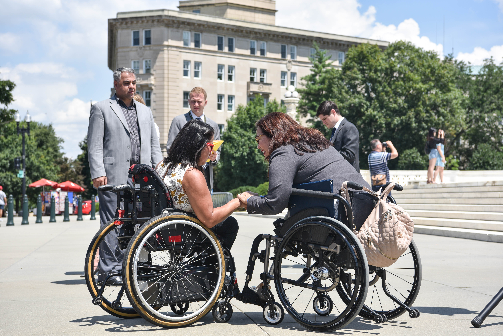

If healthcare reform is a stage play, the curtain rose anew in November, 2016.  The audience, hopeful if unsure, beheld a ragtag group of players flanking our most ill-advised main character. During the intervening months, [four radically different proposals](http://www.kff.org/interactive/proposals-to-replace-the-affordable-care-act/) have also entered the stage, [each scoring progressively worse on issues of public health.](https://www.cbo.gov/publication/52752)

For the disabled and chronically ill, [those months have been pure terror.](https://twitter.com/hashtag/ProtectOurCare) Many have felt betrayed for the promise of lower health insurance premiums, but it's difficult &mdash; and dangerous! &mdash; to [compare temporary financial costs to the value of a human life.](/2017/05/becoming-disabled/)

Last night, as expected, sleep was elusive. I closed my laptop on an onslaught of tweets covering last night's narrow defeat of the so-called "Skinny Repeal." Before the media establishes its dominant narrative, I would like a word.

## 'Wait for the show'

I opened this piece with the analogy of a stage play for one reason: the GOP's vision of reality is alarmingly similar. Recently diagnosed with brain cancer, it should be obvious why McCain is central to this discussion. Last night, while preparing to appear on the house floor, he [told clustered reporters to 'wait for the show'.](https://twitter.com/loisbeckett/status/890785290255613952)

This is not a show. It's a murderous charade taxing the mental, physical, and emotional health of our country that disproportionally harms those who are disabled and chronically ill. The GOP should be ashamed: not just of the disjointed, often falsified reports that have been written in support of their plan, but of promulgating the ruse that this will help currently disadvantaged patients receive quality care.

Unlike BuzzFeed reporter Sarah Mimms, who was  [asking folks to refrain from criticizing John McCain](https://twitter.com/SarahMMimms/status/889920415216357377) in the wake of his health news, I believe McCain is a prominent figure in this debate and shouldn't be ignored.

## The Turning Point

CNN heralded last night's pivotal vote by McCain as his ["maverick moment."](http://www.cnn.com/2017/07/28/politics/john-mccain-maverick-health-care/index.html). Meanwhile, The Washington Post is shouting about ["The night John McCain killed the GOP's health care fight."](https://www.washingtonpost.com/powerpost/the-night-john-mccain-killed-the-gops-health-care-fight/2017/07/28/f5acce58-7361-11e7-8f39-eeb7d3a2d304_story.html) Numerous Twitter intellectuals think the ["stalwart women" of the GOP](https://twitter.com/JillFilipovic/status/890820408580100096) deserve principal credit for last night's results.

Both perspectives are currently vying for attention as the principal narrative, and they're all equally wrong. However, in order to better understand, we will ponder the merits of each for a moment.

In an earlier speech to the Senate, McCain told his colleagues, "we're getting nothing done, my friends," just prior to his vote in favor of restoring regular order, which he cast with the full knowledge of potential negative impacts on his consituency and the country. Elevating McCain now, as if he hasn't had opportunities to speak out and act before now is ignorant at best.

As for renegade Republican senators like Lisa Murkowski who voted [against the skinny repeal](https://votesmart.org/candidate/key-votes/15841/lisa-murkowski#.WXtBedPytE4), I'm grateful for their support but that doesn't revoke my license to criticise their political history. Shelley Moore Capito, another GOP senator, was quoted three weeks ago indicating that she would nix the bill if the final version didn't pass her moral test. “I only see it through the lens of a vulnerable population who needs help, who I care about very deeply," she [told Politico.](http://www.politico.com/story/2017/07/09/capito-gop-senator-opposes-health-bill-240311) "So that gives me strength. If I have to be that one person, I will be it.”

[Capito voted in favor of last night's skinny repeal proposal.](https://www.nytimes.com/interactive/2017/07/25/us/politics/senate-votes-repeal-obamacare.html)

## Is it 'time to move on'?

McConnell was quoted in [The Hill](http://thehill.com/homenews/senate/344271-mcconnell-time-to-move-on-after-healthcare-defeat) this morning as saying it's "time to move on" after his gambit to repeal the ACA failed. I don't trust this peace, and nor should you. For months, healthcare repeal has been a [stop-and-go process,](https://www.nytimes.com/2017/07/28/us/politics/senate-health-care-highlights-mccain-murkowski.html) and I doubt this recess will be any different.

In the meantime, if you want to thank a group for saving the future of healthcare in this country, don't turn to the privileged women of the GOP, or a politician who's been riding on his positive record for years.

It was [disabled activists](http://www.rollingstone.com/politics/news/why-disability-rights-activists-stormed-mitch-mcconnells-office-w489441) [putting their lives on the line](https://www.democracynow.org/2017/7/27/the_rolling_resistance_meet_three_disability), while expecting this kind of erasure after the fact, that made a difference. Don't be fooled.